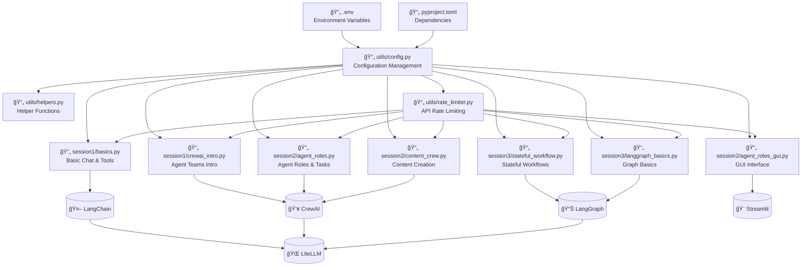

# 🤖 AI Agent Workshop for Beginners

## Welcome!

**Hello!** This is a simple workshop to learn about AI agents. We'll build smart AI helpers that can work together like a team. No advanced coding experience needed!

## What You'll LearnP

- How AI agents work (like smart assistants)
- How to make multiple AI agents work together
- How AI can remember information between steps
- **🆕 Advanced Features**: Intelligent rate limiting and error handling for production-ready AI applications

## Before We Start

You need:

- **Python** (version 3.8 or higher) - most computers already have this!
- **Basic Python knowledge** - if you can write `print("hello")`, you're ready!
- **Internet connection** - to talk to AI services
- **A computer** - Windows, Mac, or Linux

## 🚀 Quick Setup (5 minutes!)

### Step 1: Get the Code

```bash
# Download this project
git clone <repository-url>
cd ai-agent-workshop
```

### Step 2: Install Tools

```bash
# Install the UV package manager (easy Python installer)
# On Windows:
powershell -c "irm https://astral.sh/uv/install.sh | iex"

# On Mac/Linux:
curl -LsSf https://astral.sh/uv/install.sh | sh
```

### Step 3: Install Python Packages

```bash
# Install all needed tools (dependencies are now managed in pyproject.toml)
uv sync
```

### Step 4: Get Your AI Key

1. Go to [OpenRouter.ai](https://openrouter.ai) and sign up (it's free!)
2. Get your API key from the keys page
3. Copy `.env.example` to `.env`:
   ```bash
   cp .env.example .env
   ```
4. Open `.env` and replace `your_openrouter_api_key_here` with your real key

### Step 5: Test Everything Works

```bash
python -c "import crewai; print('✅ Ready to start!')"
```

## 🎯 What We'll Build (3 Simple Sessions)

### Session 1: Your First AI Agent (30 minutes)

Learn the basics! We'll create:

- A simple AI that can chat
- An AI that can use tools (like a calculator)
- Your first AI "crew" (team)

**Run it:**

```bash
cd session1
python basics.py          # Learn basic AI chat
python crewai_intro.py    # Learn about AI teams
```

### Session 2: AI Agents Working Together (30 minutes)

Make AI agents collaborate! We'll build:

- Agents with different jobs (researcher, writer)
- A simple content creation team
- How agents share information

**Run it (Command Line):**

```bash
cd session2
python agent_roles.py     # See different AI jobs
python content_crew.py    # Watch AI create content together
```

**🎨 Interactive GUIs Available!**

**Session 2 Agent Roles GUI:**

```bash
# Run the beautiful agent roles workshop GUI
streamlit run session2/agent_roles_gui.py

# Or use the launcher:
python run_session2_gui.py
```

**Session 2 Advanced GUI:**

```bash
# Run the comprehensive multi-team GUI
streamlit run session2_gui.py
```

**GUI Features:**

- 🎨 Beautiful, modern web interfaces
- 👥 Interactive agent team demonstrations
- 📊 Real-time progress tracking
- 💾 Results history and comparison
- 🎯 Educational explanations
- 🔄 Demo mode (works without API keys!)

### Session 3: Smart Workflows (30 minutes)

AI that remembers! We'll create:

- Workflows that pass information between steps
- AI that learns from previous steps
- Simple state management

**Run it:**

```bash
cd session3
python stateful_workflow.py  # See AI remember information
```

## 📁 What's In This Project

```bash
ai-agent-workshop/
├── README.md              # This guide (you're reading it!)
├── pyproject.toml         # Project configuration and dependencies
├── .env.example          # Template for your settings
├── session2_gui.py       # 🎨 Interactive web GUI for Session 2
├── run_session2_gui.py   # Launcher for the GUI
├── session1/             # Basic AI examples
│   ├── basics.py         # Your first AI agents
│   └── crewai_intro.py   # AI working in teams
├── session2/             # AI collaboration
│   ├── agent_roles.py    # Different AI jobs
│   └── content_crew.py   # AI creating content together
├── session3/             # Smart workflows
│   ├── stateful_workflow.py  # AI that remembers
│   └── langgraph_basics.py  # Graph basics
└── utils/                # Helper tools (you don't need to change these)
    ├── config.py         # Configuration management
    ├── helpers.py        # Utility functions
    └── rate_limiter.py   # 🆕 Intelligent API rate limiting
```

#### 🏗️ Code Architecture Diagram



## 📊 Individual File Code Architectures

### Session 1: Basic AI Interactions

**File: `session1/basics.py`** - Demonstrates fundamental AI chat and tool usage with LangChain

```mermaid
flowchart TD
    A[🚀 main<br/>Entry Point] --> B[💬 basic_chat_example<br/>Chat Demo]
    A --> C[🔢 simple_math_helper<br/>Math Demo]

    B --> D[🤖 ChatOpenAI<br/>LLM Instance]
    C --> D

    D --> E[⚙️ get_config<br/>Configuration]
    E --> F[🔧 get_agent_config<br/>Agent Settings]

    F --> G[📡 invoke<br/>API Call]
    G --> H[📄 Display Response]
```


**File: `session1/crewai_intro.py`** - Introduction to multi-agent systems with CrewAI

```mermaid
flowchart TD
    A[🚀 main<br/>Entry Point] --> B[👥 create_simple_crew<br/>Crew Setup]
    B --> C[🤖 Agent<br/>AI Assistant]
    B --> D[📋 Task<br/>Work Assignment]
    B --> E[🎯 Crew<br/>Team Orchestrator]

    C --> F[⚙️ get_config<br/>Configuration]
    F --> G[🔧 get_agent_config<br/>Agent Settings]
    G --> H[🤖 ChatOpenAI<br/>LLM Instance]

    E --> I[▶️ kickoff<br/>Execute Tasks]
    I --> J[📊 Display Results]
```


### Session 2: Multi-Agent Collaboration

**File: `session2/agent_roles.py`** - Demonstrates different AI agent roles working together


**File: `session2/content_crew.py`** - Complete content creation workflow with specialized agents

```mermaid
flowchart TD
    A[🚀 main<br/>Entry Point] --> B[📝 run_content_creation_workflow<br/>Main Workflow]
    B --> C[👥 create_content_creation_crew<br/>Agent Setup]
    B --> D[📋 create_content_tasks<br/>Task Setup]

    C --> E[🔍 Agent<br/>Researcher]
    C --> F[✍️ Agent<br/>Writer]
    C --> G[✏️ Agent<br/>Editor]

    D --> H[📋 Task<br/>Research Task]
    D --> I[📋 Task<br/>Writing Task]
    D --> J[📋 Task<br/>Editing Task]

    E --> K[⚙️ get_config<br/>Configuration]
    F --> K
    G --> K
    K --> L[🔧 get_agent_config<br/>Agent Settings]
    L --> M[🤖 ChatOpenAI<br/>LLM Instance]

    H --> N[👥 Crew<br/>Content Crew]
    I --> N
    J --> N

    N --> O[▶️ kickoff<br/>Execute Workflow]
    O --> P[📄 Display Final Result]
```


### Session 3: Stateful Workflows

**File: `session3/stateful_workflow.py`** - Demonstrates AI workflows that remember information between steps

```mermaid
flowchart TD
    A[🚀 main<br/>Entry Point] --> B[🔄 run_simple_workflow<br/>Main Demo]
    B --> C[⚙️ create_simple_workflow<br/>Workflow Setup]

    C --> D[📊 StateGraph<br/>Workflow Graph]
    C --> E[🧠 WorkflowState<br/>State Definition]

    D --> F[🔍 research_step<br/>Research Node]
    D --> G[📝 draft_answer_step<br/>Draft Node]
    D --> H[✅ final_answer_step<br/>Final Node]

    F --> I[🔀 decide_next_step<br/>Router Function]
    G --> I
    H --> I

    I --> J[🏁 END<br/>Workflow Complete]
    I --> F
    I --> G
    I --> H

    F --> K[🔍 Agent<br/>Researcher]
    G --> L[✍️ Agent<br/>Writer]
    H --> M[✏️ Agent<br/>Editor]

    K --> N[⏱️ create_rate_limited_llm<br/>Rate Limited LLM]
    L --> N
    M --> N

    N --> O[⚙️ get_config<br/>Configuration]
    O --> P[🔧 get_agent_config<br/>Agent Settings]
    P --> Q[🤖 ChatOpenAI<br/>LLM Instance]

    B --> R[▶️ app.invoke<br/>Execute Workflow]
    R --> S[📊 Display Results]
```


**File: `session3/langgraph_basics.py`** - Fundamental LangGraph concepts and conditional routing

```mermaid
flowchart TD
    A[🚀 main<br/>Entry Point] --> B[🧠 run_basic_langgraph_example<br/>Basic Example]
    A --> C[🔀 demonstrate_conditional_routing<br/>Routing Demo]

    B --> D[⚙️ create_langgraph_workflow<br/>Workflow Creation]
    D --> E[📊 StateGraph<br/>Graph Builder]
    D --> F[🧠 AgentState<br/>State Definition]

    E --> G[🔍 research_node<br/>Research Node]
    E --> H[📊 analyze_node<br/>Analysis Node]
    E --> I[💡 answer_node<br/>Answer Node]
    E --> J[🎛️ router_function<br/>Decision Logic]

    G --> K[📡 LLM.invoke<br/>API Call]
    H --> K
    I --> K

    J --> L[🏁 END<br/>Complete]
    J --> G
    J --> H
    J --> I

    C --> M[🧠 QueryState<br/>State Definition]
    C --> N[🏷️ classify_query<br/>Classification]
    C --> O[📝 simple_response<br/>Simple Handler]
    C --> P[📋 complex_response<br/>Complex Handler]
    C --> Q[🎯 route_based_on_complexity<br/>Smart Router]

    N --> R[📡 LLM.invoke<br/>Classify Query]
    O --> S[📡 LLM.invoke<br/>Simple Answer]
    P --> T[📡 LLM.invoke<br/>Complex Answer]

    Q --> U[🏁 END<br/>Complete]
    Q --> O
    Q --> P

    B --> V[▶️ app.invoke<br/>Execute]
    C --> W[▶️ app.invoke<br/>Execute]
    V --> X[📊 Display Results]
    W --> X
```


### Utils: Helper Modules

**File: `utils/config.py`** - Central configuration management and validation system

```mermaid
flowchart TD
    A[🔑 get_config<br/>Global Instance] --> B[⚙️ WorkshopConfig<br/>Main Class]
    B --> C[📥 _load_config<br/>Load Settings]
    B --> D[🔄 _convert_types<br/>Type Conversion]
    B --> E[✅ validate<br/>Configuration Check]

    C --> F[📂 load_environment_variables<br/>From helpers.py]
    F --> G[📄 load_dotenv<br/>Load .env file]
    F --> H[🔐 validate_api_key<br/>Key Validation]

    B --> I[🤖 get_agent_config<br/>Agent Settings]
    B --> J[🔄 get_workflow_config<br/>Workflow Settings]
    B --> K[💾 save_to_env_file<br/>Persist Config]

    I --> L[🏷️ openrouter/model<br/>Model Prefix]
    J --> M[⏱️ timeout/debug<br/>Workflow Params]

    E --> N[🔑 API Key Check]
    E --> O[🤖 Model Validation]
    E --> P[🌡️ Temperature Range]
    E --> Q[🔢 Token Limits]
```


**File: `utils/helpers.py`** - Utility functions for environment handling and data processing

```mermaid
flowchart TD
    A[📂 load_environment_variables<br/>Env Loading] --> B[📄 load_dotenv<br/>Load .env]
    A --> C[🔐 validate_api_key<br/>Key Validation]
    A --> D[📊 Return Dict<br/>Env Variables]

    E[📝 format_agent_response<br/>Response Formatting] --> F[🔤 String Check]
    E --> G[🔄 Object Conversion]
    E --> H[🧹 Clean Output]

    I[📊 create_progress_indicator<br/>Progress Bar] --> J[🔢 Calculate Percentage]
    I --> K[▬ Create Bar String]
    I --> L[📄 Return Formatted String]

    M[🛡️ safe_get_nested_value<br/>Safe Dict Access] --> N[🔍 Try Key Access]
    M --> O[⚠️ Exception Handling]
    M --> P[🔙 Return Default]

    Q[✂️ truncate_text<br/>Text Truncation] --> R[📏 Length Check]
    Q --> S[➕ Add Suffix]
    Q --> T[📄 Return Truncated]

    U[📋 format_workflow_summary<br/>Summary Creation] --> V[📊 Extract State Data]
    U --> W[📝 Format Lines]
    U --> X[📄 Return Summary]

    Y[🤖 get_available_models<br/>Model List] --> Z[📋 Return Model Array]
    AA[💰 estimate_cost<br/>Cost Calculation] --> BB[🔢 Token Estimation]
    AA --> CC[🔍 Cost Lookup]
    AA --> DD[💵 Return Cost]
```


**File: `utils/rate_limiter.py`** - Intelligent API rate limiting and retry logic

```mermaid
flowchart TD
    A[🛡️ RateLimiter<br/>Main Class] --> B[🚀 __init__<br/>Initialize]
    A --> C[⏱️ _calculate_delay<br/>Delay Calculation]
    A --> D[🔍 _extract_retry_after<br/>Header Parsing]
    A --> E[🚨 _is_rate_limit_error<br/>Error Detection]
    A --> F[🔄 call_with_retry<br/>Retry Logic]

    B --> G[🔢 max_retries<br/>Retry Count]
    B --> H[⏱️ base_delay<br/>Base Delay]
    B --> I[⏱️ max_delay<br/>Max Delay]

    C --> J[📈 Exponential Backoff<br/>2^attempt]
    C --> K[🎲 Add Jitter<br/>±25%]
    C --> L[🛑 Cap at Max<br/>Delay Limit]

    D --> M[🔍 Regex Search<br/>X-RateLimit-Reset]
    D --> N[📅 Timestamp Parse]
    D --> O[🧮 Calculate Delay]

    E --> P[🔤 Error String Check]
    E --> Q[🎯 Keyword Match<br/>rate limit, 429, etc.]

    F --> R[🔁 Retry Loop<br/>max_retries + 1]
    F --> S[⏱️ Rate Limiting<br/>Min Interval]
    F --> T[⚠️ Exception Handling]
    F --> U[⏱️ Delay Calculation]
    F --> V[✅ Success Return]

    W[🏭 create_rate_limited_llm<br/>Factory Function] --> X[🛡️ RateLimiter<br/>Instance]
    W --> Y[🤖 ChatOpenAI<br/>LLM Creation]
    W --> Z[🤖 Return LLM<br/>With Retry Logic]
```



## 🆘 Having Problems?

### "API Key Not Working"

- Check your `.env` file has the correct key from OpenRouter
- Make sure there are no extra spaces
- Try copying the key again from OpenRouter

### "Rate Limit Exceeded"

The workshop includes **intelligent rate limiting** to handle API limits gracefully:

- **Free accounts**: 50 requests/day limit on OpenRouter
- **Automatic retries**: Scripts retry failed requests with exponential backoff
- **Smart timing**: Extracts exact reset times from API responses

**Solutions:**

- Add $10 credits to OpenRouter for 1000 daily requests
- Wait for the daily reset (usually midnight UTC)
- The rate limiter will automatically handle temporary limits

### "Package Installation Failed"

```bash
# Try reinstalling dependencies
uv sync --reinstall
```

### "Python Not Found"

- Download Python from python.org (version 3.8+)
- Make sure `python` command works in terminal

### Still Stuck?

- Check that all files are in the right folders
- Try running: `python -c "print('Python works!')"`
- Ask for help - you're learning something new! 🚀

## 🎉 You're Done!

**Congratulations!** You've learned about AI agents. What you built:

- 🤖 AI that can chat and use tools
- 👥 AI agents working as a team
- 🧠 AI that remembers information between steps
- ⚡ **Production-ready features**: Intelligent rate limiting, error handling, and API resilience

## Next Steps

Ready for more? Try:

- Change the questions in the examples
- Add your own AI agents
- Build something fun with what you learned!

---

**Happy AI Building!** 🚀🤖
